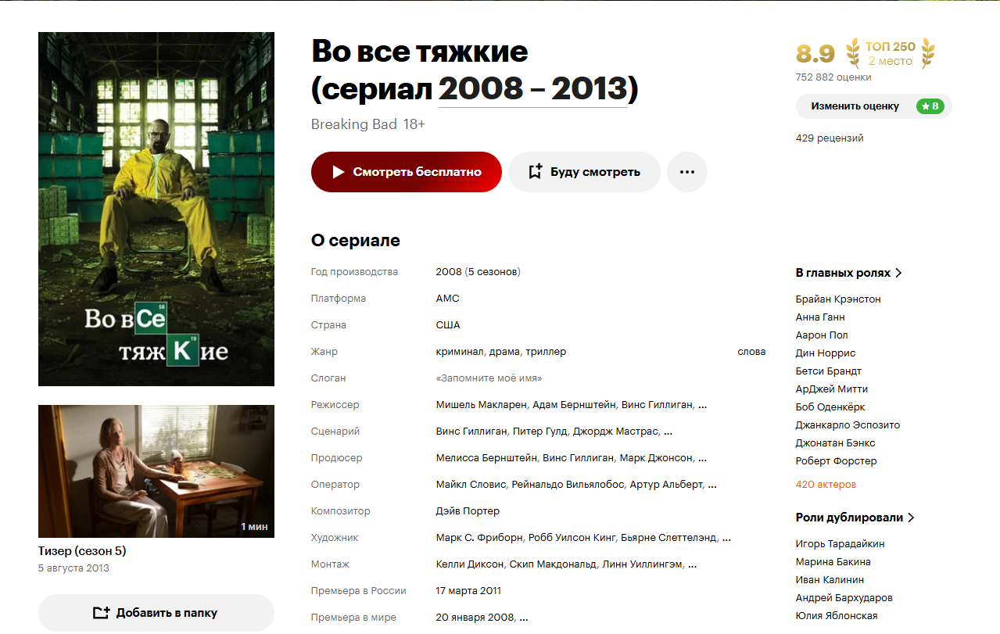
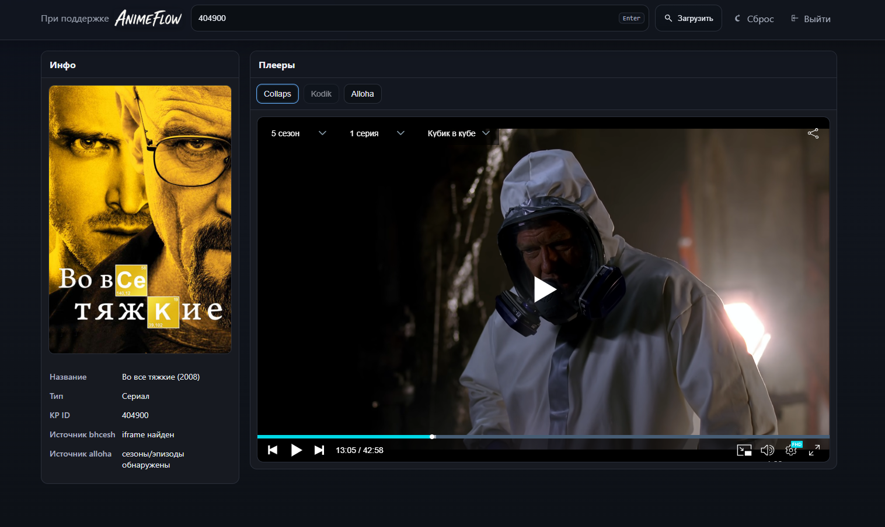

  
  &nbsp;&nbsp;
  

---

# Бесплатный Кинопоиск

Этот проект даёт быстрый способ открыть плеер с фильмом/сериалом из Кинопоиска — без лишних кликов и беготни по сайтам.

  

  

## FAQ

### Зачем нужен код доступа?
- Чтобы на сайт не ходили случайные люди с улицы.
- Чтобы снизить внимание правообладателей и автоматических жалоб.
- Чтобы сам домен не блочили и он жил дольше.

Без кода доступ к плеерам не даётся — сначала нужно ввести код, и он сохраняется на время сессии.

### Как убрать рекламу в плеере?
- Никак с нашей стороны.
- Реклама встроена прямо в плееры сторонних источников (bhcesh / alloha / kodik).

### Это вообще безопасно?
- Скрипт не передаёт наши токены.
- Скрипт не лезет в твой аккаунт Кинопоиска.
- Страница с плеером не сохраняет и не логирует твои куки от Кинопоиска — ей нужен только ID фильма/сериала.

---

## Состоит из двух частей:

1. **Userscript для Tampermonkey (`freekinopoisk.user.js`)**  
   Добавляет на страницу фильма/сериала на Кинопоиске кнопку «Смотреть бесплатно».  
   При нажатии открывается наш сайт с плеерами.

2. **Приватная страница с плеером (если заходите сделать подобное или изучить содержимое) (PHP)**  
   Принимает ID Кинопоиска, достаёт данные из сторонних API (bhcesh / alloha / kodik), и показывает удобный интерфейс с плеерами.
